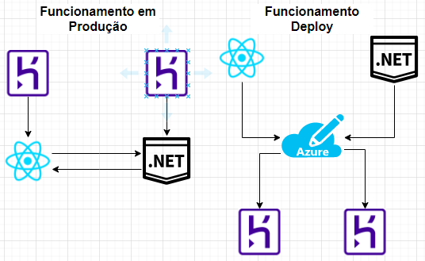

<h2 align="center">📊 Prática em Desenvolvimento de Software</h2>

## Conteúdo
- [Conteúdo](#conteúdo)
- [Equipe](#equipe)
- [Escopo](#escopo)
- [Arquitetura](#arquitetura)
- [Tecnologias Envolvidas](#tecnologia-envolvida)
  - [Front-End](#front-end)
  - [Back-End](#back-end)
  - [Banco de Dados](#banco-de-dados)
  - [Monitoramento](#monitoramento)
  - [Servidor](#servidor)
  - [Protótipos de tela](#prototipos-de-tela)
  - [Scrum](#scrum)

## Equipe
A equipe responsável por desenvolver esse projeto é:
- Daniel Quirino - dpq@ufmg.br
- Lucas Silva
- Matheus Lima
- Ricardo de Oliveira

## Escopo
**Motivação:** Com o surgimento e aumento das plataforma de Streaming além das consequências do Covid, a utilização dessas mídias tem aumentado bastante nos últimos tempos. Assim sendo, vemos a oportunidade de forneccer um serviço que é especializado em organizar e engajar os usuários na troca de informações e opiniões sobre filmes, séries, documentários e outras mídias audiovisuais. 

**Descrição:** O projeto a ser desenvolvido consiste em uma rede social para entusiastas de séries, filmes, documentários e outros títulos audiovisuais. Nela, os usuários poderão registrar quais desses videos assistiram, dando sua opinião e avaliando os mesmos, além de encontrar outras pessoas que compartilham dos mesmos gostos para comentar sobre os títulos.

Principais funcionalidades mapeadas:
- Perfil do usuário
- Perfil dos títulos audivisuais, com a possibilidade de comentar, avaliar e ver essas mesmas informações dos outros usuários 
- Painel de buscas para procurar esses títulos audivisuais
- Painel para buscar outros usuários

Projeto foi inspirado no [Skoob](https://www.skoob.com.br/), que é como se fosse uma rede social de livros. 

**Sprint - Colocar em produção?:** Não teremos uma sprint apenas para colocar em produção, acreditamos que seja melhor fazer um MVP básico e colocar em produção a partir da primeira sprint, para que seja possível gerar valor no menor período de tempo.

## Arquitetura

## Tecnologias Envolvidas

### Front-End
- Gerenciador de pacotes padrão: [yarn](https://yarnpkg.com/)
- Biblioteca utilizada: [Reactjs](https://pt-br.reactjs.org/)
- Testes End-2-End: [Cypress](https://www.cypress.io/)
- Testes de Interface: [React Test Library](https://testing-library.com/docs/react-testing-library)
- Testes unitários: [Jest](https://jestjs.io/)
- Repositório: [Link](https://github.com/Daniel-Quirino/compartilhar-filmes-front)

### Back-End
- Linguagem: C#
- Plataforma de desenvolvimento de software: [.Net](https://docs.microsoft.com/pt-br/dotnet/core/introduction)
- Repositório do BackEnd: [Link](https://github.com/Daniel-Quirino/compartilhar-filme-backend)

### Banco de Dados
- Banco de Dados: [PostgreSQL](#https://www.elephantsql.com/)

### Monitoramento
- [Google Analytics](https://analytics.google.com/)
- [Hotjar](https://www.hotjar.com/)

### Servidor
- [Heroku](https://www.heroku.com/)

### Protótipos de tela
- [Figma](https://www.figma.com/login)

### Scrum
Utilizaremos a metologia ágil SCRUM, assim sendo, achamos melhor utilizar a ferramenta de Gestão de Backlog do Azure DevOps para poder fazer esse gerenciamento, assim, podemos ter as informações de todo o nosso backlog, as estórias criadas, o andamento da sprint, gráficos de Burndown e várias outras métricas que o Azure DevOps nos fornece. Criamos um projeto que pode ser acessado por esse [link](https://dev.azure.com/pds-2020/PDS-2020/). Caso o link não funcione, é preciso aceitar o e-mail que foi enviado dando a permissão para poder acessar a ferramenta.
